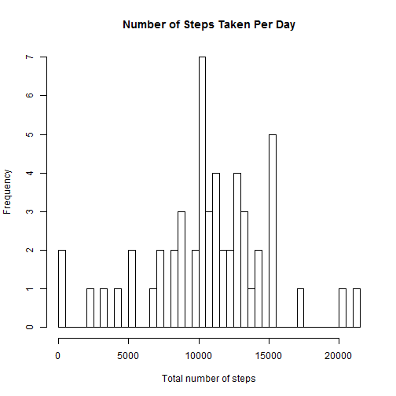
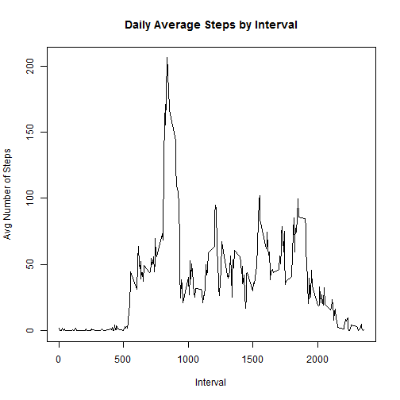
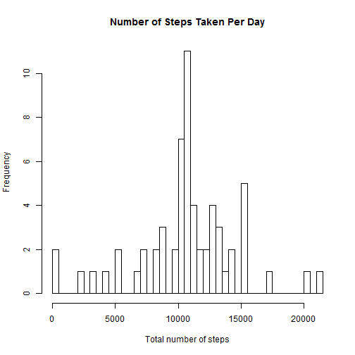
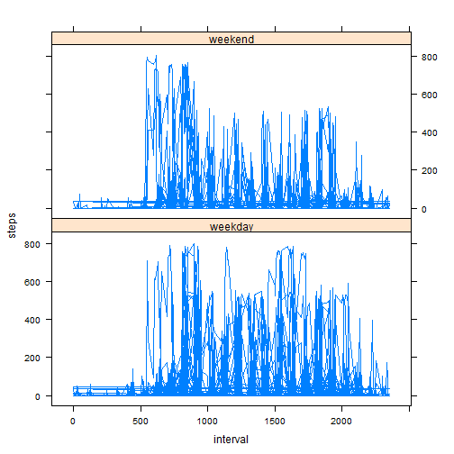

Reproducible Research Assignment 1
==================================
Author: Robert W Allen

###Load Necessary Data  

1. download the file containing the personal activity monitoring device zip file from this link: [Activity Monitoring Data](https://d396qusza40orc.cloudfront.net/repdata%2Fdata%2Factivity.zip)
2.  Set working directory to directory where the activity file is located.
3. Read the csv file into R and name it activity  


```r
activity <- read.csv("activity.csv")
```

Below is a summary of the key variables in the activity data set.

```r
head(activity)
```

```
##   steps       date interval
## 1    NA 2012-10-01        0
## 2    NA 2012-10-01        5
## 3    NA 2012-10-01       10
## 4    NA 2012-10-01       15
## 5    NA 2012-10-01       20
## 6    NA 2012-10-01       25
```

```r
summary(activity)
```

```
##      steps                date          interval     
##  Min.   :  0.00   2012-10-01:  288   Min.   :   0.0  
##  1st Qu.:  0.00   2012-10-02:  288   1st Qu.: 588.8  
##  Median :  0.00   2012-10-03:  288   Median :1177.5  
##  Mean   : 37.38   2012-10-04:  288   Mean   :1177.5  
##  3rd Qu.: 12.00   2012-10-05:  288   3rd Qu.:1766.2  
##  Max.   :806.00   2012-10-06:  288   Max.   :2355.0  
##  NA's   :2304     (Other)   :15840
```

###Analysis 1:  Steps Taken Per Day

1.  Calculate the total number of steps per day.

```r
totalsteps <- tapply(activity$steps, activity$date, sum)
setbreaks <- NROW(totalsteps)
```
2.  Graph the data as a histogram.

```r
hist(totalsteps, freq = TRUE,
     breaks = setbreaks,
     main = "Number of Steps Taken Per Day",
     xlab = "Total number of steps")
```

 
3. Produce the Mean and Median of the total number of steps.

```r
stepsmean <- mean(totalsteps, na.rm = TRUE)
stepsmean <- format(stepsmean, digits = 2, nsmall = 2)
stepsmedian <- median(totalsteps, na.rm = TRUE)
stepsmedian <- format(stepsmedian, digits = 2, nsmall = 2)
```
* Mean Steps: 10766.19  
* Median Steps: 10765  

###Analysis 2:  Average Daily Activity

1.  Calculate the average number of steps taken per interval and create time-series plot.  

```r
avgsteps <- aggregate(activity$steps, by = list(activity$interval), FUN = mean, na.rm = TRUE)
avgsteps <- setNames(avgsteps, c("Interval", "AvgSteps"))
plot(avgsteps[["Interval"]], y = avgsteps[["AvgSteps"]], 
     type = "l",
     main = "Daily Average Steps by Interval",
     xlab = "Interval",
     ylab = "Avg Number of Steps")
```

 

2.  Find the interval with the maximum number of steps.  

```r
maxint <- which.max(avgsteps$AvgSteps)
interval <- avgsteps[["Interval"]][maxint]
```
The interal with the largest average number of steps is 835.

###Analysis 3:  Imputing Missing Values

1.  Report on missing values.

```r
narec <- activity$steps[activity$steps == "NA"]
nas <- length(narec)
```
The total number of NA values in the steps field is 2304  
2.  Fill in missing values with the average number of steps.

```r
activitynona <- activity
x <- mean(avgsteps$AvgSteps)
activitynona$steps[is.na(activitynona$steps)] <- x
```
3.  Plot this new dataset for reviewing the differences between the original dataset and the new dataset.


```r
totalstepsnona <- tapply(activitynona$steps, activitynona$date, sum)
setbreaksnona <- NROW(totalstepsnona)

hist(totalstepsnona, freq = TRUE,
     breaks = setbreaksnona,
     main = "Number of Steps Taken Per Day",
     xlab = "Total number of steps")
```

 

```r
stepsmeannona <- mean(totalstepsnona, na.rm = TRUE)
stepsmeannona <- format(stepsmeannona, digits = 2, nsmall = 2)
stepsmediannona <- median(totalstepsnona, na.rm = TRUE)
stepsmediannona <- format(stepsmediannona, digits = 2, nsmall = 2)
```
* Mean Steps: 10766.19  
* Median Steps: 10766.19 

The mean of the two datasets is exactly.  However, for the new dataset the median and the mean are also now the same.  

The impact imputing the data has had is the new dataset, while complete, may skew the results.

###Analysis 4:  Differences in Activity Patterns.
1.  Create new factor variable indicating the day of the week and add it to the dataset.

```r
days <- weekdays(as.Date(activitynona$date))
dayfact <- factor(days, labels = c("weekday", "weekday", "weekday", "weekday", "weekday", "weekend", "weekend"))
```

```
## Warning in `levels<-`(`*tmp*`, value = if (nl == nL) as.character(labels)
## else paste0(labels, : duplicated levels in factors are deprecated
```

```r
activitynona <- cbind(activitynona, as.vector(dayfact))
activitynona <- setNames(activitynona, c("steps", "date", "interval", "weekday"))
```
2.  Plot the data by the day of the week.

```r
library(lattice)
xyplot(steps ~ interval|weekday, data = activitynona, type = "l", layout = c(1,2))
```

 

